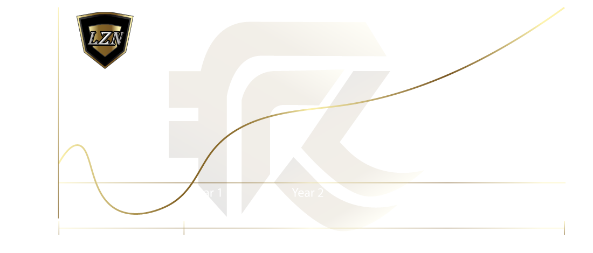

# What Is Rebase And APY?

## <mark style="color:yellow;">What Is Rebase And APY?</mark>

The annual percentage yield (APY) is a measure of the real rate of return on a principal amount of tokens, taking into account the effect of compounding interest. In the case of the Luzion Protocol, LZN tokens represent the principal and compound interest is added at regular intervals, known as rebase events, which occur every 15 minutes. The new principal amount is the current Mind token amount plus the new rebase token amount, and this total is used to calculate the next rebase rewards.

It is important to note that the balance grows exponentially over time due to compound interest. For example, with a daily compound interest rate of 2.28635%, a balance of 100 LZN tokens on day 1 would grow to approximately 383,125.800 LZN tokens after one year. This illustrates the power of compound interest and the potential for significant growth through the APY calculation.

<figure><figcaption><p>Graph Showing the Relationship Between Token Value, Supply, and Inflation/Deflation</p></figcaption></figure>

The APY calculation is a useful tool for evaluating the potential return on an investment over a certain period of time. It is important to consider the effect of compounding interest when evaluating the potential return on an investment, as it can greatly impact the final balance.

In the case of the Luzion Protocol, LZN tokens represent the principal and compound interest is added at regular intervals, known as rebase events. The size of the rebase and the frequency at which it occurs can significantly affect the APY and the overall growth of the investment. As the balance grows through compound interest, the APY will also increase, leading to even greater potential returns.


It is worth noting that the APY calculation assumes a constant interest rate and frequency of compounding. In practice, these factors may vary and could affect the actual return on an investment. It is important to carefully consider all relevant information and perform due diligence before making any investment decisions.


### <mark style="color:yellow;">Rebase Rate Logic Code Section</mark>


```solidity
/**
 * @dev Rebase logic that will run internally.
 */
    function rebase() internal {
        
        if ( inSwap ) {
            return;
        }

        uint256 deltaTimeFromInit = block.timestamp - initRebaseStartTime;
        uint256 deltaTime = block.timestamp - lastRebasedTime;
        uint256 times = deltaTime.div(15 minutes);
        uint256 epoch = times.mul(15);

        if (deltaTimeFromInit < (365 days)) {
            rebaseRate = 2355;
        } else if (deltaTimeFromInit >= (365 days) && deltaTimeFromInit < ((15 * 365 days) / 10)) {
            rebaseRate = 211;
        } else if (deltaTimeFromInit >= ((15 * 365 days) / 10) && deltaTimeFromInit < (7 * 365 days)) {
            rebaseRate = 14;
        } else if (deltaTimeFromInit >= (7 * 365 days)) {
            rebaseRate = 2;
        }

        for (uint256 i = 0; i < times; i++) {
            supplyTotal = supplyTotal.mul((10**rateDecimals).add(rebaseRate)).div(10**rateDecimals);
        }

        gonsPerFragment = gonsTotal.div(supplyTotal);
        lastRebasedTime = lastRebasedTime.add(times.mul(15 minutes));

        pairContract.sync();

        emit RebaseInitiated(epoch, supplyTotal);
        
    }
```



To ensure the most accurate and reliable rebase rate, we chose to prioritize the use of timestamps in determining the rate. To further ensure the rebase rate consistently follows the intended trajectory, we included code to reference both prior and subsequent timestamps.&#x20;

While it may have been possible to optimize the rebase rate through alternative means, such as placing the first rate in the last else if code section, we deemed it more important to prioritize the use of timestamps in order to guarantee the most consistent and predictable behavior.


### <mark style="color:yellow;">Explanation of Factors Affecting LZN Token Rebasing Timing</mark>

The LZN token is designed to undergo constant rebasing based on timestamps, regardless of the occurrence of sale transactions. The rebasing process occurs continuously in the background on the blockchain, but the rebase rate is only updated and synchronized with individual token holders' supply totals upon the completion of a sale transaction.&#x20;


The LZN token's rebase rate is updated and synchronized with individual token holders' supply totals exclusively through the occurrence of sale transactions. Upon completion of a sale, the updated rebase rate is disseminated to all token holders' wallets, effectively adjusting the total supply of LZN in circulation.


This is achieved through the emission of a rebase event, which serves as a trigger to execute the updated rebase rate on the blockchain. It is worth noting that, due to the decentralized nature of the blockchain, the execution of updated rebase rates is dependent on the presence of a trigger event, such as a sale transaction.

1. The LZN token is set to constantly rebase based on timestamps.
2. This rebasing process occurs continuously in the background on the blockchain.
3. The rebase rate is only updated and synchronized with individual token holders' supply totals when a sale transaction is completed.
4. The completion of a sale transaction triggers the emission of a rebase event.
5. This rebase event serves as a trigger to execute the updated rebase rate on the blockchain.
6. The updated rebase rate is only executed when a trigger event, such as a sale transaction, occurs.
